Multi-Currency Admin Guide
==========================

Overview
--------

Multiple currency functionality for OroCRM Enterprise edition is a
useful tool for companies that do business internationally and negotiate
deals in various currencies.

As an example, let us suppose that you are a US-based business and you
are shipping certain goods to a UK based company. Your base currency is
US dollars, which means that this is the currency that your business’s
turnover is usually in. The contract between you and the UK company,
however, is to be signed in British pounds for the total value of
£20 000. When creating a new opportunity for the mentioned contract, you
would need to add the **Budget Amount** in pounds rather than dollars.

With OroCRM Enterprise multi-currency feature, the system can make the
necessary recalculations of this budget amount into the base currency
for you. This means that if you enter the amount of £20 000 into the
Budget Amount field, this value will be converted into your base
currency and constitute $25 050 (as illustrated in the screenshot
below). This conversion is calculated according to the currency rate,
determined by a member of your team (e.g. a sales manager).

|

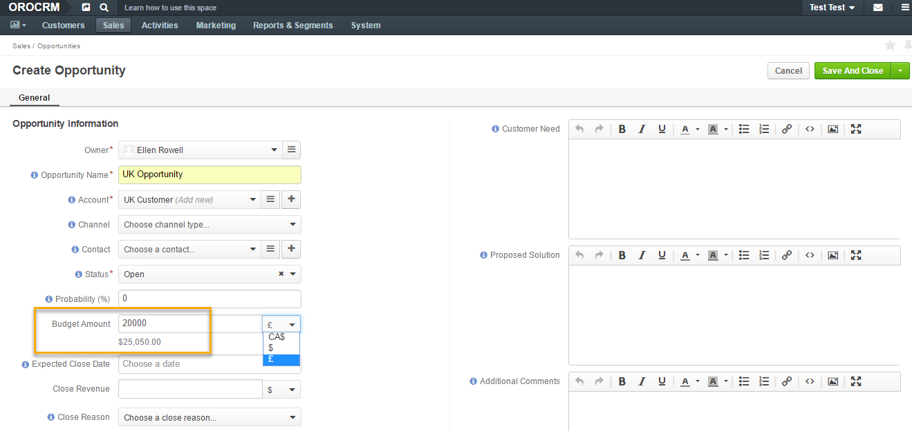

|

With this example in mind, let us have a look at how you can configure
your currencies and rates.

Configuration
-------------

Currency and rate configuration can be achieved at two levels, the
**System level** and the **Organization level**. You can find more
information on access levels :ref:`in Access Management guide <./access-management-roles>`__.

At the system level, an admin sets up system currencies and rates. The
currencies that the admin sets will be the only currencies available at
the organization level (for a sales manager, for instance).

Admin can add and delete currencies and change rates.

To configure currencies as an admin, navigate to **System>
Configuration** in the main menu.

|

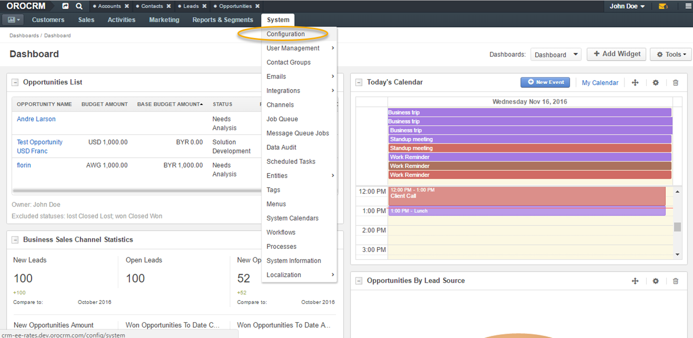

|

Next, open **System Configuration** dropdown list on your left, select
**General Setup** and click **Currency**.

|

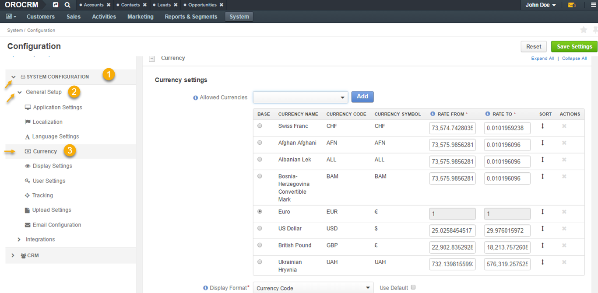

|

Currency Settings
~~~~~~~~~~~~~~~~~

The following sections will be available within the **Currency** tab:

+------------------------+------------------------------------------------------------------------------------------------------------------------------------------------------------------------------------------------------------------------------------+
| **Field**              | Description                                                                                                                                                                                                                        |
+========================+====================================================================================================================================================================================================================================+
| **Allowed currencies** | Allowed currencies dropdown menu contains a list of all available currencies. This setting controls how the currencies will be identified within the system, by a 3-letter ISO code (e.g. GBP) or by the currency symbol (e.g. £). |
|                        | Note: Not all currencies might have symbols. For such currencies, ISO codes are used instead.                                                                                                                                      |
+------------------------+------------------------------------------------------------------------------------------------------------------------------------------------------------------------------------------------------------------------------------+
| **Display format**     | Allows you to select the currency display format across the system, e.g. USD ISO code or $ currency symbol.                                                                                                                        |
+------------------------+------------------------------------------------------------------------------------------------------------------------------------------------------------------------------------------------------------------------------------+

|

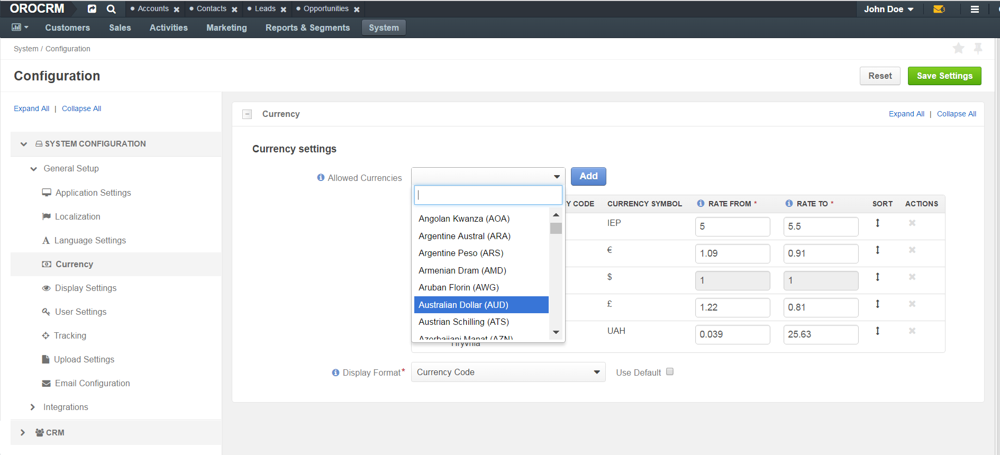

|

|

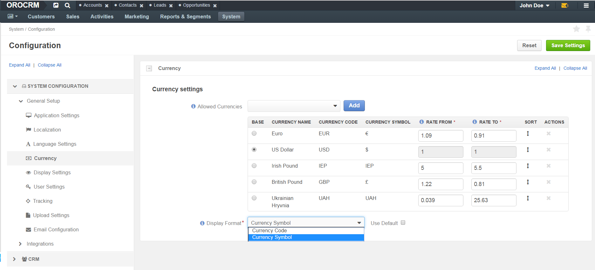

|

The grid contains several columns:

+---------------------+----------------------------------------------------------------------------------------------------------------------------------------------------------------------------------------------+
| **Field**           | Description                                                                                                                                                                                  |
+=====================+==============================================================================================================================================================================================+
| **Base**            | Allows to select the base currency (i.e. the default currency used within the organization) by ticking one or the other currency. Only one base currency can be selected at a time.          |
+---------------------+----------------------------------------------------------------------------------------------------------------------------------------------------------------------------------------------+
| **Current Name**    | Contains the full names of the added currencies.                                                                                                                                             |
+---------------------+----------------------------------------------------------------------------------------------------------------------------------------------------------------------------------------------+
| **Currency Code**   | Contains ISO codes of the added currencies.                                                                                                                                                  |
+---------------------+----------------------------------------------------------------------------------------------------------------------------------------------------------------------------------------------+
| **Currency Symbol** | Contains the currency symbols. If no symbol is applicable to a currency, a currency ISO code is used instead.                                                                                |
+---------------------+----------------------------------------------------------------------------------------------------------------------------------------------------------------------------------------------+
| **Rate From**       | The rate of the selected currency to the base currency. It is used to calculate transaction amounts (e.g. opportunity budget) in base currency if they were entered in a different currency. |
|                     | E.g. If a UK company wants to sign a deal with your US based company and the value of the deal is in GBP, you would need to see the value of the deal in US dollars.                         |
+---------------------+----------------------------------------------------------------------------------------------------------------------------------------------------------------------------------------------+
| **Rate To**         | The conversion rate of the base currency to the selected currency. It is used to calculate new exchange rates when the base currency is changed.                                             |
|                     | E.g. If you need to sign a contract with a client in GBP and the value of your contract is in US dollars, your UK client would like to see the cost in GBP.                                  |
+---------------------+----------------------------------------------------------------------------------------------------------------------------------------------------------------------------------------------+
| **Sort**            | Change the order of the added currencies by dragging them up and down to the preferred position.                                                                                             |
+---------------------+----------------------------------------------------------------------------------------------------------------------------------------------------------------------------------------------+
| **Actions**         | The cross sign allows to delete the selected currency.                                                                                                                                       |
+---------------------+----------------------------------------------------------------------------------------------------------------------------------------------------------------------------------------------+

Only currencies enabled by the admin at the system level are available
in the **Currency** section at the organization level. Therefore, a
sales manager would be able to manage rates at the organization level
for the currencies setup by the admin at the system level.

.. note:: Currently, to allow a sales manager to manage rates, the admin needs to give them access to manage organization records when configuring user roles. This, however, is subject to change in the next release. Therefore, the following guide on accessing Currency at organization level is temporary and will be actualized shortly.
 

For the sales manager to be able to manage currencies, they would need to:

-  Navigate to **System>User Management>Organizations.**
   
|

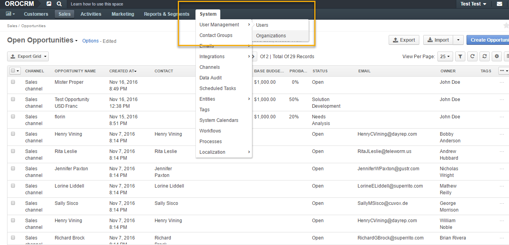

|

-  Click on their organization in the grid.
  
|

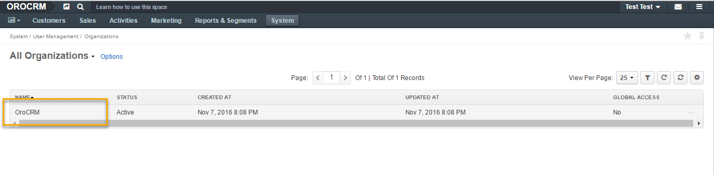

|

-  Click **Configuration** in the top right corner.
|

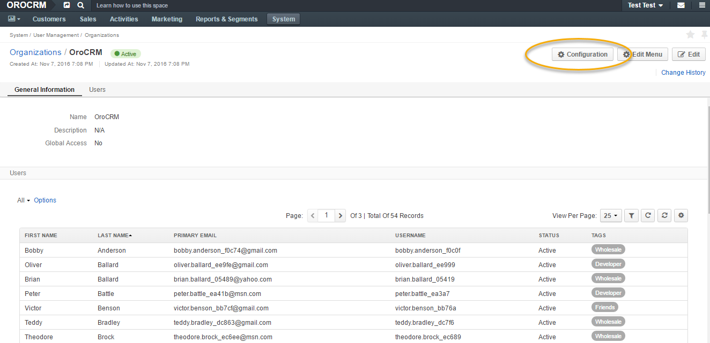

|

-  Open **Currency** tab from the menu on the left.

As you can see in the screenshot below, **Use System** is ticked which
means that at this point s\ *ystem* currencies and rates are activated.

For the sales manager to be able to change the rates, they would need to
unlock the grid by unticking **Use System**.

|

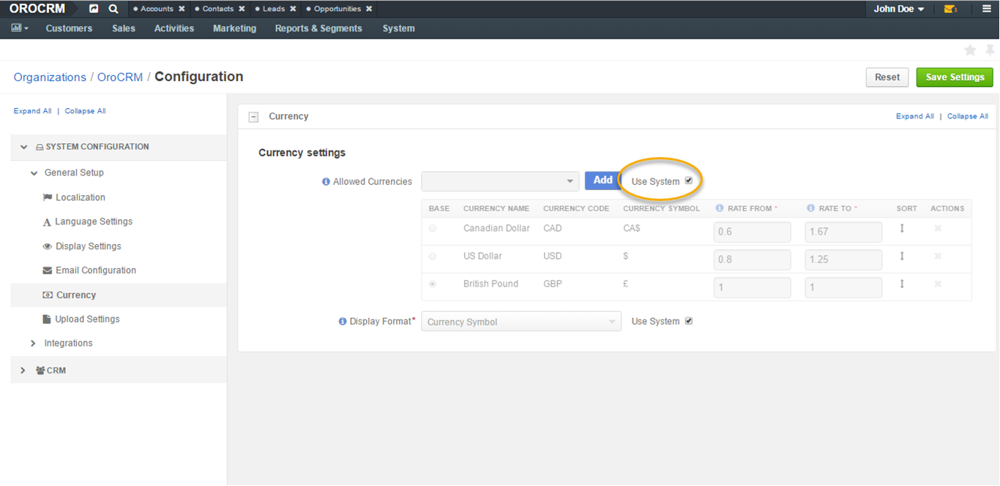

|

|

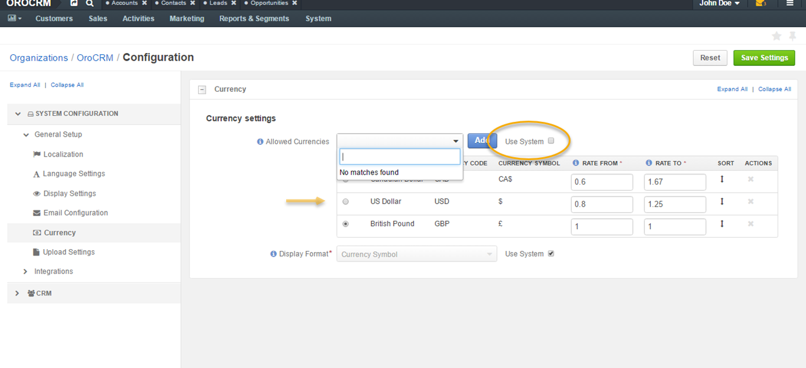

|

Change currency rate
~~~~~~~~~~~~~~~~~~~~

To change the currency rate manually, the sales manager needs to enter
the numbers in the corresponding field of the Rate From/To columns.

For example, if the rate of US dollar to British pound is 0.8016, a
sales manager would enter 0.8016 in the Rate From field. The system will
automatically calculate the Rate To value for US dollars which will
constitute 1.2525.

|

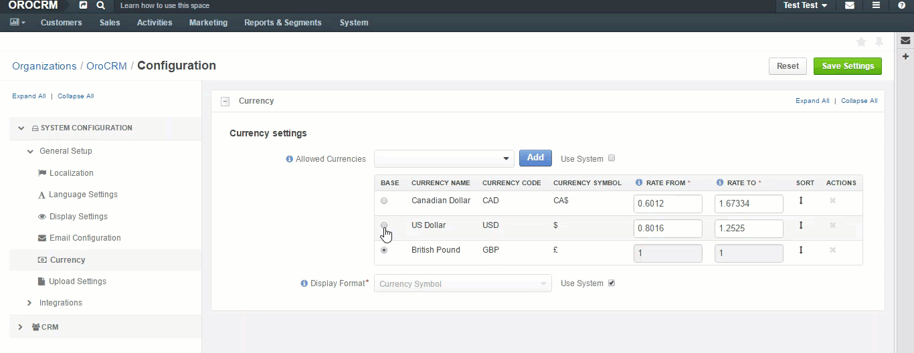

|

The base currency rate is always 1 to 1 and cannot be changed.

Adding and Deleting Currency
~~~~~~~~~~~~~~~~~~~~~~~~~~~~

A sales manager cannot add the currency that is not set at the system
level.

For example, if at the system level the admin has set up 3 currencies –
US dollars, Canada dollars and British pounds, then at the organization
level the sales manager will be able to see no more than these 3
currencies. In other words, it is possible to have fewer than those 3
currencies (by deleting the ones that the sales manager does not need)
but not more.

If you delete a currency at organization level, it would appear in the
**Allowed Currencies** field, so it would be possible to add it back if
necessary.

|

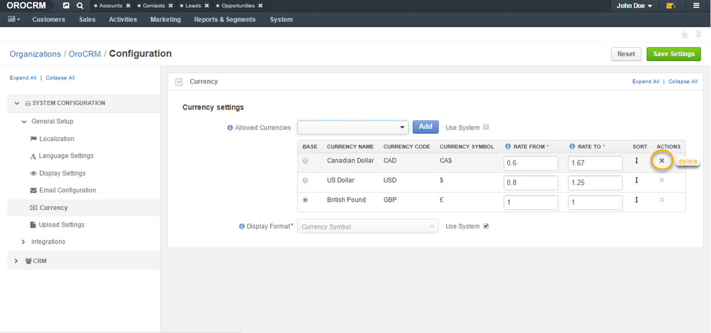

|

|

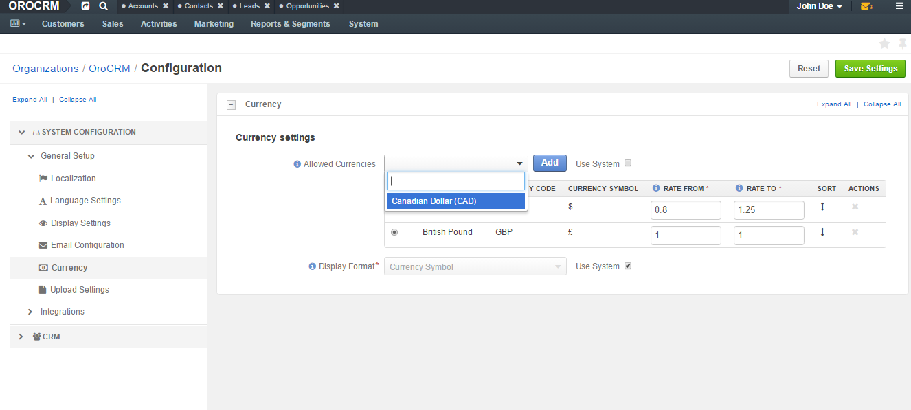

|

Note: You cannot delete the currency that is already in use.

 .. note:: In later releases, if you wish to delete the currency that is used by an entity (e.g. an opportunity), you would have an option of converting it into a different currency.
  
   

To add the deleted currency back, select it from the Allowed Currencies
dropdown menu and click **Add**.

Changing Base Currency
~~~~~~~~~~~~~~~~~~~~~~

In the example below, the base currency is British pounds but the budget
of the deal is in US dollars. In the following screenshot, you can see
how this is displayed for opportunities:

|

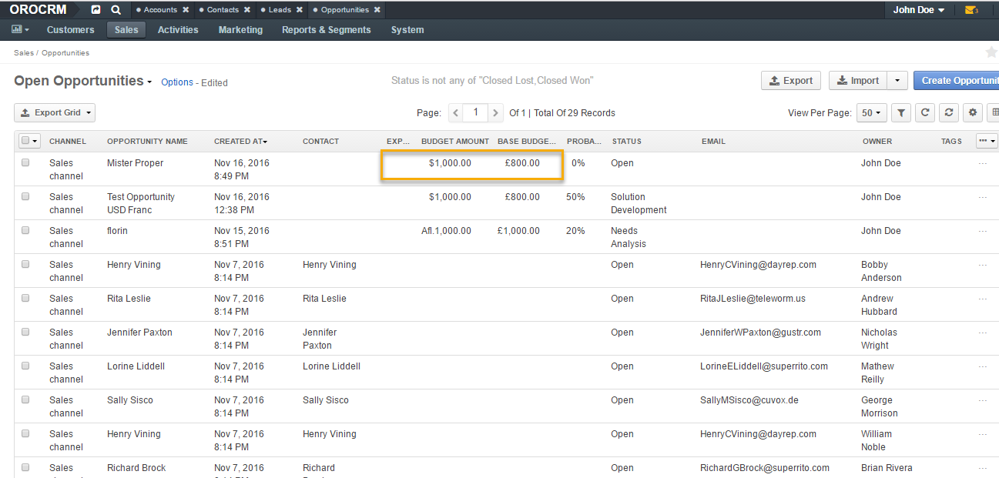

|

You can change the base currency by selecting the currency in the
**Base** column of the grid.

In the following example, the base currency is switched from British
pounds into Canadian dollars. Changing the base currency in the grid
automatically recalculates the rates of other currencies to the new base
currency.

|

|

Changing the base currency results in currency change for entities:

|

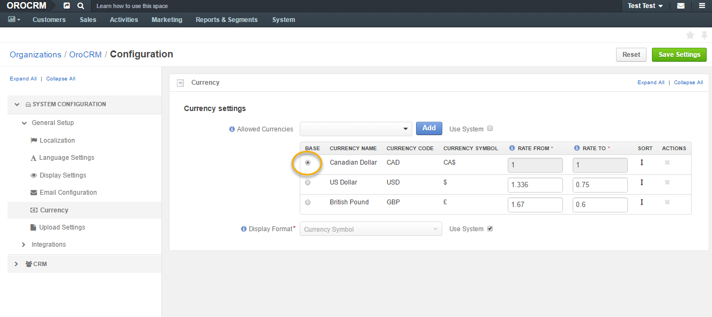

|

|

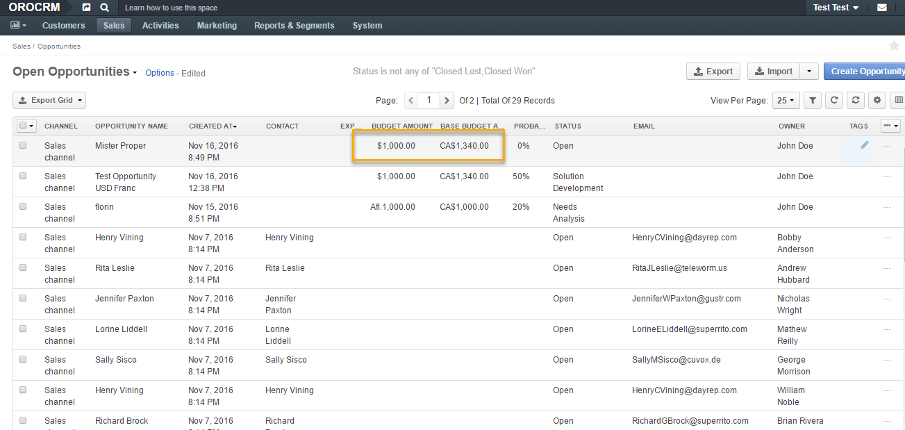

|

.. note:: All widgets work in the base currency irrespective of the currency that the deals were made in.

|

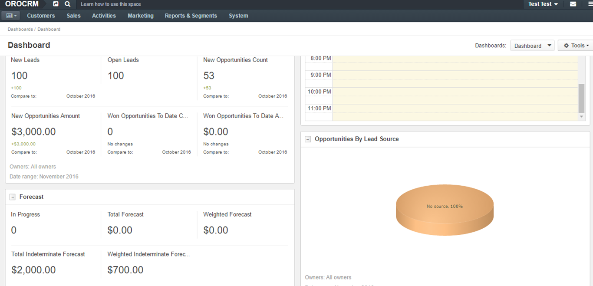

|

 
  